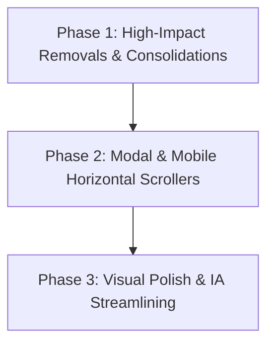

# BuildWithLami
## Content & UI Simplification Audit & Approval Document

> **Status:** PENDING CLIENT APPROVAL  
> **Prepared by:** Senior CRO Strategist, Information Architect & UX Consultant  
> **Target Platform:** BuildWithLami (Official Software Engineering Studio of Eugene Odibenuah)  
> **Rule Enforcement:** Zero website modifications will occur until items in Section 12 are explicitly reviewed and approved.

---

### Objective

To transform BuildWithLami into a high-converting, state-of-the-art freelance software engineering studio website by eliminating cognitive overload, repetitive content, and vertical scroll fatigue—while elevating high-value technical proof, client qualification signals, transparent 50/50 milestone pricing, and primary conversion pathways.

```
LESS CLUTTER  ·  LESS SCROLLING  ·  CLEARER VALUE PROPOSITION  ·  FASTER UNDERSTANDING
STRONGER CTA VISIBILITY  ·  PREMIUM STUDIO FEEL  ·  FLAWLESS MOBILE UX
```

---

# Executive Summary

### 1. What is currently causing clutter?
* **Multi-Page Content Duplication:** The same core messages—tech stack breakdowns, development process steps, 50/50 milestone billing explanations, 4-month post-launch maintenance guarantees, and contact forms—are repeated 3 to 5 times across Home, Software, Services, About, Projects, and Contact pages.
* **Page Identity Diffusion:** 
  * The **Homepage** attempts to be the entire business (hosting full projects, full services, 4-step process, testimonials, 3-pillar pricing, about snippet, 3 SaaS ventures, 6 FAQs, and a contact form).
  * The **Services Page** embeds the entire 74KB interactive `Pricing.jsx` component and a duplicate 6-step workflow, causing excessive vertical scroll (>12,000px).
  * The **Software Page** duplicates the interactive pricing estimator and client contact form, acting as an alternative homepage rather than a specialized technical hub.
* **Internal SaaS Distraction:** Inactive SaaS product showcases (*NaijaPay Compliance Pro*, *School ERP*, *Hospital ERP*) with dummy links (`#`) create confusion regarding whether BuildWithLami is a client services studio or a product company.
* **Heavy Footer Canvas:** The Matter.js physics engine in the footer adds script weight, visual distraction, and layout instability beneath the conversion goal.

### 2. The Biggest Sources of Unnecessary Content
1. **Redundant Process Steppers:** 3 different workflows across 3 pages (4-step on Home, 6-step on Services, 5-step on About, 3-step on Contact).
2. **Duplicate Scoping Calculators & Forms:** Software page and Pricing page both run independent pricing/scoping calculators with overlapping logic.
3. **Over-Detailed Visible Deliverables:** Services and project portfolio cards display exhaustive bullet points that belong in focused modals or dedicated case study pages.
4. **Repeated Tech Stacks:** Tech stacks appear in the Navbar (Resume), Hero, Homepage Services modal, Software page, About page (25+ cards), Project Detail page, and the Footer physics simulation.

### 3. The Biggest Opportunities
* **Establish a Canonical Page Hierarchy:** Let each page excel at its single conversion purpose (Home = Positioning & Proof; Services = Solutions & Deliverables; Projects = Visual Showcase; Case Studies = Deep-Dive Architecture & Results; Pricing = Transparent Scope & Quote Calculator; About = Trust & Founder Story; Contact = Frictionless Intake).
* **Progressive Disclosure:** Move secondary technical details, infrastructure deep-dives, and granular checklists into clean modal drawers and accordions.
* **Mobile Snap Carousels:** Transform tall vertical stacks (Service cards, Pricing cards, Testimonials, Process steps, Related projects) into touch-friendly horizontal card carousels (~85% viewport width), slashing mobile page length by 60–70%.
* **Focused CTAs:** Replace duplicate raw forms across subpages with contextual "Start a Project" anchor cards that link directly to `/contact` with pre-filled query parameters.

### 4. What Must Remain Untouched (Conversion Anchors)
* **50/50 Milestone Invoicing Terms (50% Upfront, 50% on Delivery):** Proven trust builder that lowers client risk.
* **4 Months Included Post-Launch Support & Warranty:** Distinctive value proposition and differentiator.
* **100% IP & Source Code Ownership Transfer:** Essential assurance for serious founders and enterprise clients.
* **High-Value Case Study Narrative Structure:** *Problem → Constraints → Solution → Results → Technical Architecture*.
* **Location-Aware Currency Switching (NGN / USD):** Seamless cross-border quoting.
* **Founder Identity & Direct Communication (Eugene Odibenuah):** Eliminates agency bloat; clients know exactly who is engineering their system.

---

# 1. REMOVE

| Priority | Page | Section / Element | Recommendation | Reason | Conversion Impact |
|---|---|---|---|---|---|
| **P1** | **Home** | SaaS Products & Ventures (`SaaSProducts.jsx`) | **REMOVE** section from homepage | 3 internal SaaS concepts with dead `#` links confuse prospective clients who want custom client engineering. Leaks focus from agency conversion. | **HIGH (Positive):** Eliminates confusion between agency services vs SaaS. |
| **P1** | **Services** | Embedded `<Pricing />` Component | **REMOVE** embedded full pricing module from `/services` | Embedding the complete 74KB pricing calculator creates extreme page bloat (>12,000px height). Users should be routed to the dedicated `/pricing` page. | **HIGH (Positive):** Cuts Services page scroll depth by 50% and focuses intent. |
| **P1** | **Software** | Duplicate Contact Form (`#contact-form`) | **REMOVE** full inline form from `/software` | Having full forms on Home, Software, and Contact causes maintenance drift. Replace with a high-impact CTA banner linking to `/contact?division=software`. | **MEDIUM (Positive):** Funnels all leads into the optimized Contact intake engine. |
| **P1** | **Software** | Duplicate SaaS Section (`SAAS_PRODUCTS`) | **REMOVE** SaaS cards from software page | Inactive placeholder SaaS products dilute serious engineering positioning. | **MEDIUM (Positive):** Keeps focus on custom client systems. |
| **P2** | **Footer** | Matter.js Physics Tech Stack Canvas (`TechStack.jsx`) | **REMOVE** heavy Matter.js canvas from global footer | 10KB+ physics engine running on every page bottom causes scroll lag and distracts from footer navigation. Replace with clean, static tech pill strip. | **MEDIUM (Positive):** Improves performance, Core Web Vitals (INP/CLS), and visual polish. |
| **P2** | **About** | 5-Step "How I Build" Section | **REMOVE** from `/about` | Redundant with the 4-step Process on Homepage and 6-step on Services. The About page should focus on founder story, experience, education, and working principles. | **MEDIUM (Positive):** Reduces About page fatigue by 25%. |
| **P2** | **Home** | Duplicate "How I Help" bullet box in Services header | **REMOVE** right-hand bullet box in `Services.jsx` header | Repeats points already made in the Hero and WhyChoose sections. | **LOW:** Cleans up section header to let service cards take focus. |
| **P3** | **Software** | 4-Metric Stats Bar under Hero | **REMOVE** redundant counter box | Metrics like "4+ Software Projects" are modest numbers that don't add enough punch to justify prime hero real estate. | **LOW:** Strengthens hero focus on core value proposition. |

---

# 2. CONDENSE

| Page | Current Content | Proposed Version | Space Saved | Reason |
|---|---|---|---|---|
| **Home** | **Services Grid (5 tall cards with full copy & button)** | **5 Compact Service Cards** (Icon, Title, 1-sentence value hook, Timeline, and "Explore Scope →" link that opens the scope modal). | **~55% vertical height** | Homepage visitors need a quick scan of capabilities, not an encyclopedia of deliverables. |
| **Home** | **Hero Section Text & Founder Photo Badge** | Streamline headline and subtext; tighten badge padding and founder image alignment for immediate CTA visibility above the fold. | **~20% vertical height** | Ensures both "Start a Project" and "See My Work" CTAs are immediately visible on standard laptop screens without scrolling. |
| **Home** | **WhyChoose Section (4 tall vertical cards)** | Compact 4-column feature row with clean micro-icons, punchy 2-line descriptions, and unified borders. | **~40% vertical height** | Converts bulky vertical boxes into a sleek, scannable trust bar. |
| **Services** | **5 Full-Width Detailed Service Blocks** | Streamlined Service Cards with highlighted outcomes; secondary deliverables moved into tabbed view or "View Full Scope" modal. | **~60% vertical height** | Prevents scroll fatigue and lets users compare all 5 service pillars effortlessly. |
| **Projects** | **Projects Grid Card Body (Long descriptions + 4 pillars + tech pills)** | Clean Portfolio Card: Thumbnail, Category Badge, Project Title, 1-line business impact outcome, 3 key tech tags, single "View Case Study →" CTA. | **~45% vertical height** | The portfolio page exists to drive clicks into case studies, not to replace the case study. |
| **About** | **Tools & Technologies (25+ verbose cards with individual sub-paragraphs)** | Categorized Interactive Tech Grid with clean SVG icons, tool names, and category filter chips without paragraph descriptions for each tool. | **~50% vertical height** | Tech-savvy clients only need to recognize the logos/stack; paragraphs explaining "React is a UI component library" create clutter. |
| **About** | **Experience & Education (Extensive bullet lists & signatures)** | Streamlined 2-column timeline with company/university, role/degree, years, and 3 high-impact summary bullets each. | **~35% vertical height** | Improves executive scannability while preserving all credentials. |
| **Contact** | **Right-Hand Side Panels (3 separate bulky cards)** | Consolidate "Direct Reach", "WhatsApp Chat", and "Social Profiles" into 1 sleek, cohesive "Direct Connect & Verification" panel. | **~40% panel height** | Eliminates visual fragmentation beside the primary intake form. |

---

# 3. MOVE TO MODAL / DRAWER

| Page | Section | Trigger | Modal / Drawer Content | Reason |
|---|---|---|---|---|
| **Home & Services** | **Service Scope & Complete Deliverables** | `"Explore Full Scope & Deliverables →"` on any Service Card | **Interactive Service Scope Modal:** Detailed scope narrative, full 7-point deliverables checklist, Ideal For profile, Tech Stack badges, and "Start a Project with this Service" button. | Keeps main page clean and scannable while giving serious prospects instant access to granular deliverables without navigating away. *(Already proven in `Services.jsx`)* |
| **Pricing** | **Optional Add-ons Catalog (9 modular items)** | `"View All Add-ons (9) ↗"` button | **Add-ons Drawer / Modal:** Full catalog of all 9 optional capabilities with itemized pricing, descriptions, and 1-click inclusion into the Quote Builder. | Prevents 9 large add-on cards from cluttering the core 3-tier package comparison. |
| **Pricing** | **Decoupled Infrastructure Technical Specifications** | `"View Infrastructure Specs ↗"` link on tier cards | **Infrastructure Spec Sheet Modal:** CPU, RAM, autoscaling rules, failover architecture, CDN edge nodes, and database backup protocols. | High-level business clients care about uptime and reliability; engineering leads can open the technical spec modal for deep architecture validation. |
| **Software** | **Detailed Architecture Deep-Dive** | `"Explore System Architecture →"` button on Software page | **Interactive Architecture Blueprint Modal:** Microservices topology, data caching layer, WebSocket real-time sync, and security compliance pipeline. | Isolates deep technical diagrams for enterprise architects without overwhelming standard business clients. |
| **Case Study** | **Full System Architecture Layer Breakdown** | `"View Full Architectural Blueprint ↗"` | **Architecture Topology Drawer:** Layered breakdowns of Client Layer, API Gateway, Background Workers, PostgreSQL Relational Schemas, and Cloud Edge. | Preserves the clean editorial case study narrative while offering 100% technical transparency for lead engineering reviewers. |

---

# 4. ACCORDIONS

| Page | Section | Why Hide It | Trigger Label |
|---|---|---|---|
| **Home** | **FAQ Section (6 Questions)** | FAQs take up valuable vertical real estate before the final CTA. Keeping answers closed by default allows users to scan questions and expand only what they need. | *Question text with smooth chevron rotation (e.g. "What is your typical project timeline?")* |
| **Pricing** | **Detailed Package Inclusions / Feature Matrix** | Tiers should have clean price tags and core deliverables visible; secondary feature checklists (e.g., "OpenGraph meta", "XML sitemaps", "robots.txt") create visual noise. | `"See All Included Deliverables (8+) ▼"` |
| **Pricing** | **Billing, Invoicing & SLA FAQs** | Critical for objection handling (50/50 milestones, payment methods, IP transfer, support SLAs) without pushing the Quote Builder off screen. | `"Frequently Asked Billing & Contract Questions ▼"` |
| **Software** | **Technical & Architecture FAQs** | 4 technical questions regarding IP ownership, GitHub transfer, post-launch warranty, and legacy codebases. | *Question headers (e.g. "Do I own 100% of the code and intellectual property?")* |
| **Case Study** | **Development Timeline & Milestone Phases** | Chronological breakdown of Phase 01 to Phase 04 sprint history is secondary to the Problem → Solution → Results story. | `"View 4-Phase Sprint Timeline ▼"` |

---

# 5. MOBILE HORIZONTAL SCROLL

| Page | Section | Current Mobile Problem | Proposed UI | Mobile Behavior |
|---|---|---|---|---|
| **Home** | **Services Cards** | 5 tall cards create >2,500px of vertical scrolling on smartphones. | Horizontal Touch Snap Carousel | Card width: `85vw`. Shows 1 active card + peek of next card. Touch swipe with subtle dot pagination. |
| **Home** | **Why Choose Us** | 4 vertical stacked boxes cause repetitive downward scrolling. | Horizontal Snap Carousel / 2x2 Grid | Card width: `82vw` or compact 2x2 grid with micro-padding. |
| **Home & Pricing** | **Pricing Tiers (3 Cards)** | 3 tall pricing cards stacked vertically make side-by-side price/feature comparison impossible on mobile. | Horizontal Snap Carousel with sticky category tabs | Card width: `86vw`. User can easily swipe between Starter, Business ⭐, and Business Plus while keeping pricing anchors aligned. |
| **Home** | **Testimonials** | 3 large quote cards create unnecessary scroll length. | Horizontal Snap Slider with Author Avatars | Card width: `88vw`. Touch swipe with smooth spring physics. |
| **Home** | **Process Steps (How It Works)** | 4 tall cards stacked vertically lose the concept of a sequential progression. | Horizontal Connected Stepper Carousel | Card width: `78vw`. Shows step 01 → 02 → 03 → 04 in natural linear swipe order with connector lines. |
| **About** | **Tools & Technologies Grid** | 25+ tool cards create a very long 2-column mobile grid. | Horizontal Category Pill Tabs + 3x2 Icon Card Matrix | Horizontal scrolling filter tabs (Frontend, Backend, Cloud, Payments, Workflow) controlling a compact 6-card icon view. |
| **Case Study** | **Related Projects (2 Cards)** | 2 large stacked cards at page bottom before final CTA. | Horizontal Snap Slider | Card width: `85vw` with touch swipe. |
| **Software** | **Core Architecture Platforms (5 types)** | 5 tall selectable cards stacked vertically push the calculator off-screen. | Horizontal Selectable Card Rail | Card width: `75vw`. Allows horizontal swiping to pick the base architecture type. |

---

# 6. COMBINE SECTIONS

| Existing Sections | Proposed Combined Section | Reason |
|---|---|---|
| **Home: WhyChoose + HowItWorks** | **"Why BuildWithLami & How We Deliver"** | WhyChoose highlights the *principles* (Engineering, Speed, UX) and HowItWorks highlights the *4 steps* (Discovery, Design, Build, Launch). Combining them into a cohesive 2-tier "Trust & Process" block saves vertical height and tells a seamless story. |
| **Home: About Me + Founder Photo** | **Sleek Founder Authority Card** | Replace the oversized full-bleed desk setup photo and disjointed text with a compact, high-converting "Meet the Engineer" authority card with founder photo, bio, verified credentials, and direct link to `/about`. |
| **Services: "Who I Help" + 6-Step Workflow** | **Consolidated "Engineering Roadmap & Scope"** | The audience pill row and 6-step workflow can be streamlined into a clean top banner above the 5 core service offerings. |
| **Contact: 3 Separate Right-Hand Side Panels** | **Unified "Direct Connect & Verification" Card** | Merges Email/Phone details, WhatsApp Instant Chat button, and verified GitHub/LinkedIn social proof into one clean container. |
| **Software: Stack + Architecture** | **"Production Architecture & Tech Stack"** | Combines the 4 tech categories with system topology capabilities in one structured tabbed container. |

---

# 7. MOVE TO OTHER PAGES

| Current Page | Content to Move | Destination Page | Reason |
|---|---|---|---|
| **Services** | Full Interactive Pricing Module & Estimator | **`/pricing`** | Services page should explain *what gets built* and provide clear starting prices, then link to `/pricing` for custom configuration and milestone breakdowns. |
| **Home** | Deep Technical Architecture Terminology | **`/software` & Case Studies** | First-time homepage visitors want to know *business outcomes* and *proof*. Technical deep-dives belong on the Software hub and Case Study pages. |
| **Software** | Full Project Intake Form | **`/contact?division=software`** | Replaces the redundant inline form with an actionable CTA button that opens `/contact` with pre-selected software division parameters. |
| **About** | Detailed 5-Step Development Methodology | **`/services`** | Detailed step-by-step engineering workflows belong on the Services page; the About page should focus on founder background, engineering philosophy, and collaboration style. |
| **Case Study** | 20+ Tech Stack Category Icons | **Progressive Disclosure Modal** | Case study primary narrative should focus on *Why this architecture was chosen* and *What results it produced*. Raw icon lists belong in the technical modal. |

---

# 8. VISUAL CLUTTER AUDIT

| Page | Element | Recommendation | Reason |
|---|---|---|---|
| **Global** | **Multiple Inconsistent Badge Styles** | **UNIFY** to a single design token system (`text-[10px] font-bold uppercase tracking-widest px-3 py-1 rounded-full`) | Currently using a mix of square tags, pill badges, outlined tags, and emoji banners. |
| **Global** | **Excessive Gradient Borders & Heavy Shadows** | **REDUCE** to subtle `border border-gray-200 dark:border-white/10` with soft `hover:border-accent/40` | Overly thick colored borders and dark glowing shadows degrade the premium minimalist agency aesthetic. |
| **Homepage** | **"Meet The Founder" Tilted Handwritten Sticker** | **CLEAN UP** into a sleek, modern caption overlay | The casual rotated sticker conflicts with the high-ticket enterprise positioning of the headline. |
| **Navbar** | **Desktop Navigation Density (7 links + Resume + Sound + Theme + Admin)** | **STREAMLINE** to: `Software`, `Services`, `Projects`, `Pricing`, `About`, `Contact` + `Resume` button. Sound and Theme toggles grouped cleanly. | Reduces visual competition in the desktop header. |
| **Projects** | **Triple Badges on Project Cards (`Category`, `Year`, `Status`)** | **CONSOLIDATE** into a single clean metadata string: `Web Apps · 2024 · Client Build` | Three separate floating badge pills over portfolio images create visual chaos. |
| **Case Studies** | **11 Separate Full-Width Section Headers with Numbers** | **CONSOLIDATE** into 5 major editorial chapters (*01 Overview & Challenge*, *02 Solution Architecture*, *03 Key Features*, *04 Results & Proof*, *05 Technical Deep Dive*) | 11 numbered headers create an overwhelmingly long table of contents feel. |
| **Footer** | **Huge 146px `<BUILDWITH_LAMI />` Wireframe Text** | **SCALE DOWN** to a clean, balanced studio mark | Excessive font size forces unnecessary vertical scrolling in the footer area. |

---

# 9. KEEP EXACTLY AS-IS (Conversion Anchors)

The following elements are **conversion-critical** and will **NOT** be removed or diluted:

1. **50/50 Milestone Invoicing Terms:**
   * *50% Kickoff Deposit → 50% Final Delivery & Production Handover.*
   * *Why:* Directly reduces client financial risk and establishes professional credibility against low-quality competitors.
2. **4 Months Complimentary Post-Launch Maintenance & Support:**
   * *Why:* Exceptional value differentiator that eliminates client fear of post-launch abandonment or unexpected bug repair costs.
3. **100% Source Code & Intellectual Property Ownership Transfer:**
   * *Why:* Mandatory qualification requirement for serious founders, startups, and enterprise clients.
4. **Interactive Quotation Builder on `/pricing`:**
   * *Scope → Infrastructure → Optional Add-ons → Real-Time Milestone Terms.*
   * *Why:* Empowers qualified buyers to self-serve realistic estimates, drastically shortening sales cycles and filtering low-budget tire-kickers.
5. **Location-Aware Dynamic Currency Detection (NGN / USD):**
   * *Why:* Seamlessly serves Nigerian clients in Naira while quoting international diaspora/US/EU/UAE clients in USD.
6. **VonneX2X Featured Case Study:**
   * *Why:* Unequivocal proof of complex full-stack engineering capability (multi-role POS, GPS workforce tracking, automated scheduling).
7. **Direct WhatsApp Instant Chat Integration:**
   * *Why:* High-conversion direct channel for high-urgency prospects in Nigeria and emerging markets.
8. **Founder Direct Accessibility (Eugene Odibenuah):**
   * *Why:* High-ticket freelance clients buy the *engineer*, not an anonymous agency layer.

---

# 10. PRIORITY IMPLEMENTATION PLAN



## Phase 1 — High Impact (Immediate Clutter & Redundancy Elimination)
1. **Remove SaaS Products section** from Homepage and Software page.
2. **Remove embedded `<Pricing />` component** from `/services`; replace with high-converting summary card linking to `/pricing`.
3. **Remove duplicate contact forms** from Software and Services; unify all lead capture into `/contact`.
4. **Remove heavy Matter.js canvas** from global footer; replace with clean, static tech pill strip.
5. **Condense Home and Services cards** to focus on primary outcomes, moving granular deliverable lists to the existing Scope Modal.

## Phase 2 — Medium Impact (Interactive Modals & Mobile Optimization)
1. **Implement Mobile Horizontal Snap Carousels** for:
   * Services on Homepage (`85vw`)
   * Pricing Tiers on Homepage & Pricing page (`86vw`)
   * Testimonials (`88vw`)
   * Process Steps (`78vw`)
   * Related Projects on Case Studies (`85vw`)
2. **Move Decoupled Infrastructure Technical Specs & Add-ons** into clean slide-out drawers on `/pricing`.
3. **Consolidate Case Study Sections** from 11 fragmented blocks into 5 major editorial chapters with progressive disclosure for technical architecture.
4. **Streamline About Page Tech Stack** into a clean, categorized icon grid with category filter chips.

## Phase 3 — Polish (Design System & Micro-Interactions)
1. **Unify all badges, pill tags, and typography tokens** across all 10 pages.
2. **Refine Navbar and Mobile Drawer layout** for instant navigation speed.
3. **Harmonize hover states, borders, and card radius** (`rounded-2xl` / `rounded-3xl`).
4. **Validate Core Web Vitals (LCP, CLS, INP)** across all mobile and desktop viewports.

---

# 11. BEFORE / AFTER PAGE STRUCTURE

### 1. HOME (`/`)

```
CURRENT HOMEPAGE (11 Sections · >14,000px):
├── 1. Hero (Large headline, CTAs, founder image with sticker)
├── 2. Projects (Featured VonneX2X + 3 secondary cards)
├── 3. Services (5 detailed cards + "How I Help" bullet box + modal)
├── 4. Why Choose Us (4 tall reason cards)
├── 5. How It Works (4 process cards + 3 animated stats + duplicate CTA)
├── 6. Testimonials (3 client cards)
├── 7. Pricing Summary (3 pillar cards + deep link CTA)
├── 8. About Snippet (Full-bleed desk image + bio)
├── 9. SaaS Products & Ventures (3 cards with # links) ── [REMOVE]
├── 10. FAQ (6 accordion questions)
└── 11. Contact (Full form + email button)

PROPOSED HOMEPAGE (7 Focused Sections · ~5,500px · 60% Height Reduction):
├── 1. Hero: High-Converting Headline, Core Value Hook, Verified Trust Badge, Dual CTAs ("Start a Project" / "See My Work"), Founder Portrait.
├── 2. Selected Proof (Projects): Featured Case Study (VonneX2X) + 3 Curated Works with direct "View Case Study →" links.
├── 3. What I Build (Services): 5 Compact Service Cards with outcome hooks & "Explore Scope →" modals (Mobile: 85vw Horizontal Snap Rail).
├── 4. Why BuildWithLami & Process: Combined Trust Pillars + 4-Step Linear Workflow (Discovery → Design → Milestone Sprints → Launch & 4-Mo SLA) + 3 Trust Counters.
├── 5. Predictable Investment (Pricing): 3 Clean Category Starting Pillars with 50/50 milestone callout & direct "Configure Your Project Scope →" link to `/pricing`.
├── 6. Client Proof & FAQ: Testimonials (Mobile Horizontal Snap) + 4 Key Objection-Busting Accordion FAQs.
└── 7. Primary Conversion (Contact): High-Impact Project Inquiry Form + WhatsApp Direct Action + Guaranteed 24hr Response Time.
```

---

### 2. SERVICES (`/services`)

```
CURRENT SERVICES PAGE (>12,000px):
├── 1. Header (Headline + Subtitle)
├── 2. Who I Help (4 Audience Pills)
├── 3. 5 Exhaustive Service Cards (Full descriptions, Best For, Outcome quotes, 5-point deliverables, CTAs)
├── 4. Process (6-step workflow cards + 4 trust pills)
├── 5. Full Embedded Pricing Component (74KB Pricing Builder) ── [REMOVE]
└── 6. Final CTA Box

PROPOSED SERVICES PAGE (~4,500px):
├── 1. Header & Positioning: "Bespoke Web Platforms, High-Performance Interfaces & Technical Strategy".
├── 2. 5 Streamlined Service Pillars: Clean cards showing Core Problem Solved, Key Deliverable Highlights, Typical Timeline, and "Explore Full Scope & Deliverables →" Modal.
├── 3. How We Work Together: Standard 4-Step Engineering Cadence (Discovery → Architecture → Sprints → Production Handoff).
├── 4. Investment Overview Card: Starting rates per service category with 50/50 milestone terms and direct CTA button: "Calculate Custom Project Quote on Pricing Page →".
└── 5. Focused Action CTA: "Ready to scope your project?" linking to `/contact?service=selected`.
```

---

### 3. SOFTWARE (`/software`)

```
CURRENT SOFTWARE PAGE (>10,000px):
├── 1. Division Top Banner
├── 2. Hero + 4-Metric Stats Bar
├── 3. Interactive Architecture & Scoping Estimator (Duplicates Pricing page!) ── [STREAMLINE]
├── 4. Modern Engineering Stack (4 large cards with 20 pill tags)
├── 5. Selected Software Case Studies (4 project cards)
├── 6. Internal SaaS Products (3 cards with # links) ── [REMOVE]
├── 7. Technical FAQs (4 items)
└── 8. Engineering Brief Form (Duplicate full contact form) ── [REPLACE WITH CTA]

PROPOSED SOFTWARE PAGE (~4,000px):
├── 1. Technical Authority Hero: "Engineering Software Built for Real Business Scale" with focus on Architecture, Security, and Scalability.
├── 2. Architectural Capabilities & Tech Stack: Clean 4-pillar interactive tabbed grid (Frontend Architecture, Distributed Backend & APIs, Cloud Infrastructure, Payment & Security Pipelines).
├── 3. Technical Case Studies: Deep-dive previews of real software systems engineered for client operations with direct links to technical case studies.
├── 4. Engineering Standards & Guarantees: 100% Source Code Transfer (GitHub), 4 Months Free Maintenance SLA, Clean Relational Data Modeling, Sub-Second API Performance.
├── 5. Technical FAQs: 4 Accordions addressing IP ownership, code handover, testing, and legacy modernizations.
└── 6. Technical Brief CTA Banner: "Submit Your System Requirements" linking directly to `/contact?division=software`.
```

---

### 4. PROJECTS / PORTFOLIO (`/projects`)

```
CURRENT PROJECTS PAGE:
├── 1. Hero Header & Filter Tabs (All, Web Apps, E-Commerce, SaaS, Business Systems)
├── 2. Featured Case Study (VonneX2X with long summary, 3 pillars, tech tags, dual buttons)
├── 3. Remaining Project Grid (2-column cards with redundant status tags & long copy)
└── 4. CTA Footer

PROPOSED PROJECTS PAGE:
├── 1. Clean Portfolio Header: "Selected Works — High-Impact Web Applications, Digital Commerce & Enterprise Systems".
├── 2. Category Filter Chips with live project counters.
├── 3. Featured Hero Showcase (VonneX2X): High-impact image mockup, 1-line business outcome, 4 core stack pills, "View Case Study →" primary CTA.
├── 4. Curated Portfolio Grid: 2-column scannable cards featuring High-Res Mockup, Project Title, Industry/Year, 1-sentence value delivered, 3 core tech tags, "View Case Study →" link.
└── 5. Bottom Conversion Banner: "Have a unique project in mind? Let's discuss requirements." → `/contact`.
```

---

### 5. PROJECT DETAIL / CASE STUDY (`/projects/:id`)

```
CURRENT CASE STUDY (11 Sections · 1510 Lines):
├── 1. Hero & Metadata Strip & Quick Stats
├── 2. Hero Image + Lightbox
├── 3. 01 Project Overview (Summary + 6 metadata rows)
├── 4. 02 The Challenge (Problem card + Constraints + Client Goals)
├── 5. 03 The Solution (6 decision cards)
├── 6. 04 Results (4 metric cards)
├── 7. 05 Feature Showcase (Multiple category rows)
├── 8. 06 Application Flow (6 connected cards)
├── 9. 07 Responsive Gallery (Desktop, Tablet, Mobile)
├── 10. 08 Technical Deep Dive (Architecture topology table + tech pillars + timeline)
├── 11. 09 Related Projects (2 cards)
└── 12. 10 Final CTA & WhatsApp

PROPOSED CASE STUDY (5 Cohesive Editorial Chapters):
├── CHAPTER 1: Executive Overview & Challenge: Editorial Hero, Metadata Strip, Core Business Problem Solved, and High-Impact Interface Preview.
├── CHAPTER 2: Solution Architecture & Key Decisions: The 4 critical architectural choices (Frontend speed, Backend integrity, Data security, Performance).
├── CHAPTER 3: Measurable Results & Feature Highlights: 4 prominent result metrics + interactive responsive device gallery (Desktop/Tablet/Mobile with Lightbox).
├── CHAPTER 4: Technical Deep Dive (Progressive Disclosure): Collapsible / Drawer access to Production Architecture Topology, Categorized Tech Stack, and Sprint Phases.
├── CHAPTER 5: Next Steps & Related Proof: 2 Related Projects (Mobile Horizontal Snap) + Dual Action CTA ("Start a Project" / "WhatsApp Direct").
```

---

### 6. PRICING (`/pricing`)

```
CURRENT PRICING PAGE (74KB Component):
├── 1. Header (Milestone Invoicing & Support Callouts)
├── 2. Category Selector (Websites, E-Commerce ⭐, Custom Software)
├── 3. E-Commerce 3-Tier Side-by-Side Comparison Matrix Table
├── 4. 3-Tier Pricing Cards per Category (Starter/Launch, Business/Growth ⭐, Business Plus/Enterprise)
├── 5. Decoupled Infrastructure Section (Standard, Performance, High-Availability)
├── 6. Optional Add-ons Section (9 modular cards)
├── 7. Interactive Project Quotation Builder (4-step wizard + real-time 50/50 breakdown + CTA)
└── 8. Optional Add-ons Modal Dialog

PROPOSED PRICING PAGE:
├── 1. Header & Guarantees: Transparent studio pricing architecture with prominent 50/50 Milestone Terms and 4 Months Included Support badges.
├── 2. Category Selector & 3-Tier Comparison Cards:
│   ├── Websites & Portals (Starter ₦250k / Business ⭐ ₦600k / Business Plus ₦850k+)
│   ├── E-Commerce Engines (Launch ₦650k / Growth ⭐ ₦850k / Commerce Pro ₦1.2M+)
│   └── Custom Software & SaaS (MVP ₦1.2M / Growth Platform ⭐ ₦2.0M+ / Enterprise)
│   *(Mobile: Smooth horizontal swipe between tiers with sticky category selector).*
├── 3. Side-by-Side Comparison Drawer: Clean toggle button to open full deliverable comparison matrix.
├── 4. Interactive Project Quotation Builder: Streamlined 4-step configurator:
│   ├── Step 1: Select Category & Tier
│   ├── Step 2: Choose Infrastructure Resilience (Standard / Performance / High-Availability)
│   ├── Step 3: Select Optional Add-ons (via clean pill selector or "View All 9 Add-ons" drawer)
│   └── Step 4: Instant Milestone Breakdown (50% Kickoff / 50% Delivery) + "Request My Proposal" prefilled link.
└── 5. Billing FAQs & SLA Guarantees: 4 accordion items answering milestone terms, currency handling, post-launch warranty, and code ownership.
```

---

### 7. ABOUT (`/about`)

```
CURRENT ABOUT PAGE (>800 Lines):
├── 1. Hero Header
├── 2. Who I Am (Headshot + Bio card)
├── 3. Experience & Education (2 experience + 2 education entries with signature)
├── 4. Tools & Technologies (25+ verbose cards with individual paragraphs) ── [CONDENSE]
├── 5. How I Build (5-step workflow) ── [REMOVE]
├── 6. How We Collaborate (4 working style pillars)
├── 7. Visual Quick Facts (4 cards)
└── 8. Final CTA & Contact Details

PROPOSED ABOUT PAGE:
├── 1. Founder Header & Bio Bento: High-resolution portrait, founder narrative, engineering leadership philosophy, and verified Lagos/Global availability.
├── 2. Professional Credentials & Track Record: Clean 2-column card comparing Professional Experience (2021—Present) and Education & Systems Foundations (ESUT B.Sc. + Continuous Mastery) with authentic signature.
├── 3. Production Tech Stack: Clean categorized icon grid with filter chips (Frontend, Backend, Cloud, Payments, Workflow) highlighting core tools without redundant text.
├── 4. Collaboration Principles & Quick Facts: 4 working style pillars (Direct Developer Access, 50/50 Milestones, 100% IP Transfer, 4-Month Warranty) + 4 Quick Facts.
└── 5. Let's Work Together CTA: Dual action buttons ("Start a Project" / "WhatsApp Direct") + direct contact channels.
```

---

### 8. CONTACT (`/contact`)

```
CURRENT CONTACT PAGE:
├── 1. Header ("Direct Engineering & Project Inquiries")
├── 2. Intake Form (Name, Email, 8 Project Types, 5 Budgets, 4 Timelines, Message, Submit)
├── 3. 3 Right-Hand Side Panels (Direct Reach, WhatsApp Chat, Social Profiles) ── [CONSOLIDATE]
├── 4. What Happens Next? (3 process cards)
└── 5. Availability Status & Signature

PROPOSED CONTACT PAGE (Frictionless Intake Engine):
├── 1. Clear Header: "Start a Project — Direct Founder-to-Engineer Communication with 24hr Turnaround".
├── 2. Optimized Intake & Direct Reach Grid:
│   ├── Left Column (7 cols): Clean, responsive Project Brief Form with auto-prefilled parameters from Pricing/Services, instant email validation, project type selector, budget range, and message textarea.
│   └── Right Column (5 cols): Consolidated "Direct Connect & Verification" card featuring Instant Email, Direct WhatsApp link with pre-filled message, and verified GitHub/LinkedIn links.
├── 3. What Happens Next? (Expectation Setting): 3 compact reassurance steps: 01 Brief Review (within 24h) → 02 Discovery & Scope Call → 03 Concrete Proposal & Milestone Roadmap.
└── 4. Real-Time Status & Signature: Live availability indicator (Accepting new projects) + authentic digital signature.
```

---

### 9. NAVIGATION & GLOBAL ELEMENTS

```
CURRENT NAVBAR & FOOTER:
├── Desktop Navbar: Logo + Home, Software, Services, Projects, Pricing (Hot), About, Contact (7 links) + Admin + Sound + Theme + Resume Button.
├── Mobile Drawer: Fullscreen drawer with 7 links + Admin + Resume + WhatsApp + Request Proposal CTA.
├── Footer: QR Code + Matter.js Tech Stack Physics Canvas + 7 Links + 146px Headline + Email/LinkedIn/FAQs.
└── Floating Widget: WhatsApp Chat popup simulator.

PROPOSED NAVBAR & FOOTER:
├── Desktop Navbar: Logo "Ob" + 6 Primary Links: [Software] [Services] [Projects] [Pricing ⭐] [About] [Contact] + Grouped Sound/Theme + [Resume (PDF)] button.
├── Mobile Drawer: Fast, touch-optimized drawer with large tap targets, quick WhatsApp direct button, and prominent "Request Project Proposal" CTA.
├── Global Footer: Minimalist, ultra-fast footer with verified credentials, static tech stack pill strip (React · Next.js · Node · PostgreSQL · Supabase · Tailwind), navigation links, copyright, and direct email/LinkedIn. (Matter.js physics canvas removed for maximum CWV performance).
└── Floating WhatsApp Widget: Maintained on bottom right with 1.5s delayed load.
```

---

# 12. FINAL APPROVAL CHECKLIST

Please review the recommendations and indicate approval:

- [ ] **Approve Removals (Section 1):** Remove SaaS Products section, embedded `<Pricing />` from `/services`, duplicate contact forms on subpages, and heavy Matter.js footer canvas.
- [ ] **Approve Condensations (Section 2):** Condense service cards, why choose us cards, project portfolio cards, tech stack paragraph descriptions, and contact sidebar panels.
- [ ] **Approve Modal & Drawer Conversions (Section 3):** Move deep service scope deliverables, infrastructure technical specs, 9-item add-ons catalog, and case study architecture tables into interactive modals/drawers.
- [ ] **Approve Accordion Conversions (Section 4):** Keep Homepage FAQs, billing FAQs, software technical FAQs, and sprint timelines collapsible.
- [ ] **Approve Mobile Horizontal Scrolling (Section 5):** Implement touch snap carousels for Services, Pricing Tiers, Testimonials, Process Steps, and Related Projects on mobile devices (`85vw` card width).
- [ ] **Approve Section Combinations (Section 6):** Merge WhyChoose + HowItWorks, streamline About founder bento, and consolidate Contact sidebar cards.
- [ ] **Approve Inter-Page Content Routing (Section 7):** Establish clear canonical routing between Home, Services, Software, Projects, Case Studies, Pricing, About, and Contact.
- [ ] **Approve Visual Simplification (Section 8):** Standardize design tokens, unify badges, reduce heavy gradient borders, and scale footer typography.
- [ ] **Approve Preserved Conversion Anchors (Section 9):** Retain 50/50 milestone invoicing, 4 months free support, 100% IP transfer, interactive Quote Builder, currency switcher, and founder direct communication.
- [ ] **Approve Page Architecture Plan (Section 10 & 11):** Approve the phased implementation plan and before/after structures across all pages.

---

> **Awaiting User Confirmation:**  
> Reply with your approval or any specific adjustments to begin Phase 1 execution. Zero code modifications have been made.
